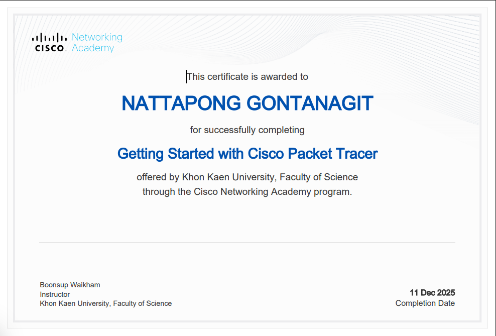

# Network-Portfolio
นายณัฐพงศ์ กรธรนกิจ 673380038-9 sec.1

Email : nattapong.g@kkumail.com

# 🌐 Network Portfolio

> This portfolio showcases my work in Computer Networks and Network Programming.

---

## 🚀 Final Project

https://drive.google.com/drive/folders/1i_OhlgE11zJG3P4IjCNy8UzWbME6L5KD?usp=sharing

---

## 📄 Personal Assignment

| Assignment | Document Link |
|-----------|--------------|
| Essay | [View](https://docs.google.com/document/d/1ix3R1YoyDwkMH_A4NKqZJos0SgsGwqqBDaHsHzhZkSY/edit?usp=sharing) |
| Assignment 2 (Topology) | [View](https://docs.google.com/document/d/1Xj20TpXkZZ-yTFvr5DVvn-SacLfvzrLXh0vgtKsh8_A/edit?usp=sharing) |
| Assignment 3 (Not Simple) | [View](https://docs.google.com/document/d/1qnItMPN-4Pi0rt1J3715s4QFb-d9k3Xq0raOQ4N9XnQ/edit?usp=sharing) |
| Assignment 4 (TCP-UDP) | [View](https://docs.google.com/document/d/1es3oKuxr3pBZgUwTmKR7w6J1fYQag78MBtjd2Q00TjA/edit?usp=sharing) |

---

## 🧪 Labs (1–5)

| Lab | Document Link |
|-----|--------------|
| Lab 1 | [View](https://docs.google.com/document/d/1DwWLAxHNynNA5J4AkVxALZkkimt_xLyojNH5TJPcgrA/edit?usp=sharing) |
| Lab 2 | [View](https://docs.google.com/document/d/18n95qmyW5_QKc7J47pIzR779M92ajxv-LmiuJoqeS54/edit?usp=sharing) |
| Lab 3 | [View](https://docs.google.com/document/d/1AWaSDerHw_D2jv64LoDjY9oQH7QFHZxg_DHghqXy5Iw/edit?usp=sharing) |
| Lab 4 | [View](https://docs.google.com/document/d/1hNBc_HnEpIDtXhB32e8D4A54Aoc28sRHZjLxWdNIHJU/edit?usp=sharing) |
| Lab 5 | [View](https://docs.google.com/document/d/1gQza0K74aVZ1GQiS_060VmBeDxAKO839r85WDEqKI3I/edit?usp=sharing) |

---

## 📜 Certificate

**Course:** Pre1 Computer Networks – Getting Started with Cisco Packet Tracer  

---

## 👤 Author

**Name:** นายณัฐพงศ์ กรธนกิจ  
**Student ID:** 673380038-9  
**Email:** nattapong.g@kkumail.com
